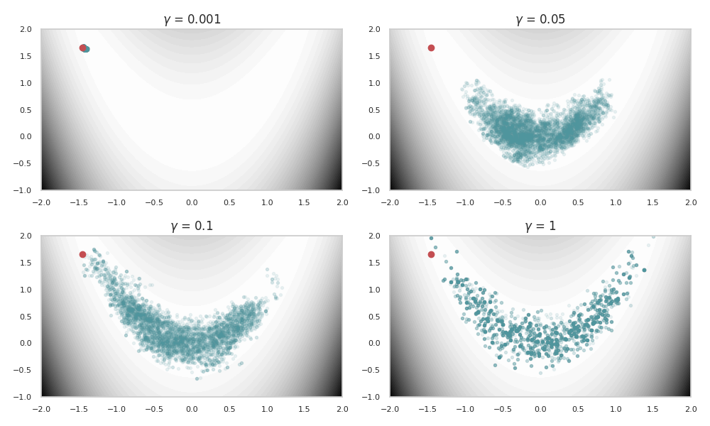
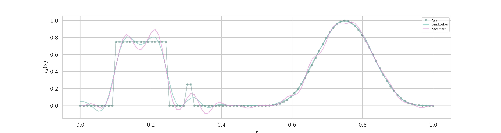
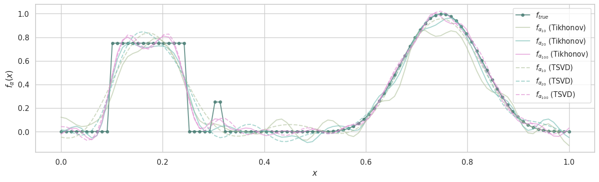

# Inverse-Problems

This repository contains the assignments and final project for the "Inverse Problems" taught by Dr. [Marcos Aurelio Capistrán Ocampo](https://salud.conahcyt.mx/coronavirus/investigacion/investigadores/maco.html) at CIMAT (Centro de Investigación en Matemáticas), developed in the Python programming language. The code is written in Spanish.

## Final Project
### Review of Stein Variational Gradient Descend Method
Reviewed PyTorch implementations of Stein variational methods, analyzed algorithms, and conducted sampling simulations. The code is based on the notebook provided in [[4](https://github.com/activatedgeek/svgd)], with some modifications.

**Mixture of Six Gaussians**

 

**Banana-shaped distribution:**

 

## Assigments
### Metropolis-Hastings Algorithm 

 

### Landweber and Kaczmarz Method

 

### TSVD and Tikhonov Regularizations

 

## Reference
1. Kaipio, J., & Somersalo, E. (2006). Statistical and computational inverse problems (Vol. 160). Springer Science & Business Media.
2. Vogel, C. R. (2002). Computational methods for inverse problems. Society for Industrial and Applied Mathematics.
3. Liu, Q., & Wang, D. (2016). Stein variational gradient descent: A general purpose bayesian inference algorithm. Advances in neural information processing systems, 29.
4. PyTorch implementation of Stein Variational Gradient Descent. https://github.com/activatedgeek/svgd
5. Anzengruber, S. W., & Ramlau, R. (2009). Morozov's discrepancy principle for Tikhonov-type functionals with nonlinear operators. Inverse Problems, 26(2), 025001.
## License
This project is licensed under the GPL-3.0 license. See the LICENSE file for details.